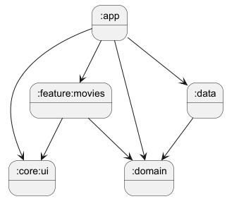

## Movie App - Promova Test Task
This is an Android application developed for the Promova test task. 
It displays lists of movies with pagination, offline caching, and favorites management, built with a modern, scalable, and testable architecture.
> More details: https://github.com/Promova/android-test-task/blob/main/README.md


## 🚀 Demo

https://github.com/user-attachments/assets/a0afc3fb-5b24-40c6-938b-a87bd28c3b0a


## ✨ Features
- **Paginated Movie List:** Displays an infinitely scrolling list of movies, grouped by month.
- **Offline Caching:** The first page of movies is cached, allowing for offline access.
- **Favorites Management:** Users can add/remove movies to a local favorites list that persists across app sessions.
- **Pull-to-Refresh:** The list can be updated using the standard pull-to-refresh gesture.
- **Share Functionality:** Allows sharing movie details via any installed application.
- **Advanced Animations:** Includes custom component animations and smooth transitions between screens.

## 🛠️ Tech Stack & Architecture
#### Tech Stack
- UI: Jetpack Compose, Material 3, Coil
- Architecture: MVI, Clean Architecture, Android Architecture Components
- DI: Hilt
- Async: Kotlin Coroutines, Flow
- Network: Ktor, Kotlinx.Serialization
- Database: Room
- Pagination: Paging 3
- Testing: JUnit, MockK, Turbine

#### Architecture
The project follows the principles of Clean Architecture, separating concerns into distinct layers and modules.
This ensures the application is scalable, maintainable, and testable.

Modules:

> 
> Modules dependencies diagram
- :app: The main application module, responsible for assembling the app.
- :core: Shared utilities, including UI components (BaseScreen, HorizontallyAnimatedContent, Loader), effect handlers, extensions.
- :domain: The core business logic layer, independent of any framework. Contains UseCases, Models, and Repository interfaces.
- :data: The data layer responsible for providing data to the domain layer. Implements the Repository interface and contains RemoteMediator, ApiService (Ktor), and DAOs (Room).
- :feature_movies: A self-contained feature module for the movies screen, containing the ViewModel and UI.


## 🏛️ Key Architectural Decisions
This project was built with a focus on robust and scalable patterns.

- Offline-First with RemoteMediator: The database is treated as the Single Source of Truth. 
- The UI always reads from the local Room database. 
- The RemoteMediator is responsible for fetching data from the network and synchronizing it with the local database, ensuring data consistency and providing offline access as required by the task. 
- A custom "upsert" logic in the DAO ensures that user-specific data (like isFavorite) is preserved during data sync.

#### MVI for a predictable UI: 
The Model-View-Intent pattern was chosen for the presentation layer. 
This ensures a unidirectional data flow, making the UI state predictable, easy to debug, and resilient to configuration changes. 
The refresh logic is controlled by the ViewModel to adhere strictly to MVI principles.

#### Advanced Side-Effect Handling: 
A reusable and extensible system for handling one-time UI events
(like Snackbars or Share Intents) was implemented using the Strategy and Chain of Responsibility design patterns.
The EffectsCollector composable acts as a dispatcher, delegating events to a list of specific EffectHandlers. 
This decouples the screen from the implementation details of each effect and follows the Open/Closed principle.

#### Type-Safe String Resource Abstraction:
To keep the ViewModel completely decoupled from the Android Framework (Context), 
a custom lightweight library (Str/StrRes) was used. The ViewModel operates with type-safe StrRes
objects containing resource IDs and arguments, while the UI layer is responsible for resolving 
them into final strings. This makes the ViewModel highly testable and platform-agnostic.

#### Compose Performance Optimization: 
To prevent unnecessary recompositions, derivedStateOf is used to compute 
UI state flags (e.g., isRefreshing). Furthermore, a custom UI model (MovieUI) 
annotated with @Stable and using immutable collections (ImmutableList) ensures 
the stability of inputs for Composables.

#### Component-Based & Reusable UI:
The UI layer was built with a strong focus on reusability. 
Common screen boilerplate is encapsulated in a generic BaseScreen composable. 
Feature-specific screen logic is isolated (e.g., AllMoviesTabContent), and custom DSL helpers 
(like the LazyListScope.pagedItems extension) were created to reduce boilerplate and improve code readability.

## 🎨 Custom UI & Advanced Animations
Beyond the core architecture, special attention was given to creating a dynamic and performant UI using Jetpack Compose's animation systems.

#### Reusable Animation Wrapper (HorizontallyAnimatedContent):
To achieve a clean, pager-like slide animation between tabs, a generic HorizontallyAnimatedContent composable was created. It encapsulates the complex transitionSpec logic, allowing for a declarative and reusable implementation of horizontal transitions between different screen states.

#### Item-level Animations in Lists:
The main movie lists leverage Modifier.animateItem() within LazyColumn to provide smooth and automatic animations for item re-ordering, insertions, and deletions, creating a more fluid user experience.

#### Fully Custom Loader Component:
Instead of using the standard CircularProgressIndicator, a unique, fully custom loader was built from scratch to demonstrate deep knowledge of the Compose graphics layer.

It uses the rememberInfiniteTransition API to orchestrate multiple, independent animations concurrently (a full 360-degree rotation combined with a variable arc sweep).
It leverages low-level drawing APIs like drawWithCache and drawArc for maximum performance and complete visual control.
The component is made configurable and performant by using a @Stable LoaderOptions data class and a rememberLoaderOptions factory function, following the best practices for creating reusable and skippable Compose components.

## 🧪 Testing Strategy
The focus of testing, as per the requirements, was on Unit Tests for the most critical logic.

#### ViewModel (MoviesViewModelTest):
Thoroughly tested using MockK and Turbine. The tests cover event handling, state mutations, side-effect emissions, and the reactive collection of data from UseCases.

#### Domain Layer (UseCase tests):
All UseCases are covered with simple delegation tests to ensure they correctly call the Repository interface.

#### Data Layer (MoviesRepositoryTest):
The repository is unit-tested for its simpler methods (favorites management, data mapping) to demonstrate the ability to test this layer in isolation by mocking the DAOs.


## 🔮 Future Improvements
#### Convention Plugins
For further scaling of the project and elimination of duplication of code in Gradle scripts, we can implement Convention Plugins. This will centralize the configuration of all modules and simplify the addition of new features.

## 🚀 How to Build & Run
### 📋 Prerequisites
#### This project was built and tested with the following environment:
- Windows 11
- Android Studio Meerkat Feature Drop | 2024.3.2
- Gradle 8.14.2

### ⚙️ Configuration Steps
#### Clone the repository:

```Shell
git clone https://github.com/AlterJuice/TheMovieDB.git
````
#### Create MovieDBService.properties file:
1. In the root directory of the project, create a directory `properties`.
2. Then create a file named `MovieDBService.properties` in the `"/properties"` directory.

#### Add your API key:

Open the `properties/MovieDBService.properties` file and add your API key from The Movie DB. It should be a Bearer Token.

```Properties
TMDB_BASE_URL = "https://api.themoviedb.org/3/"

# This key is used for authenticating with The Movie DB API
TMDB_DEBUG_API_TOKEN = "{YOUR_TOKEN}"
TMDB_RELEASE_API_TOKEN = "{YOUR_TOKEN, can be the same as TMDB_DEBUG_API_TOKEN for test project}"
```
The project is configured to read this key from BuildConfig and will not build without it.

### ▶️ Run the App
1. Open the project in Android Studio. 
2. Let Gradle sync the project dependencies. 
3. Select the app configuration and run it on an emulator or a physical device.
